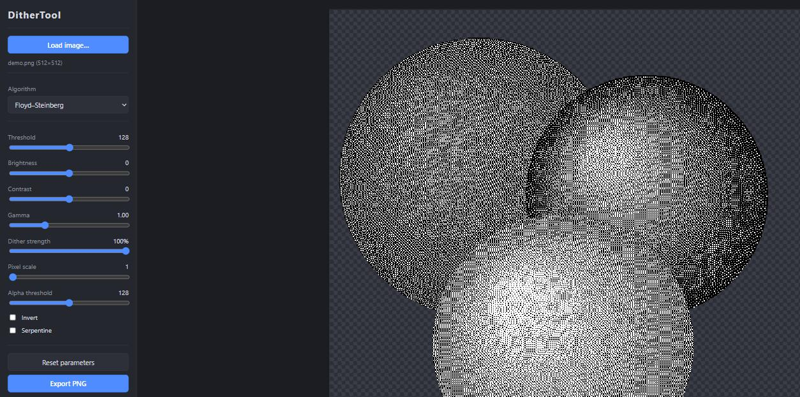

# Stippler

A zero-dependency, browser-based tool that converts color PNG images (with transparency) into pure 1-bit black & white images — with the alpha channel binarized, so every output pixel is either fully opaque black/white or fully transparent.

Built to convert sprites for [Playdate](https://play.date/) ports of PC DOS games — the Playdate has a 1-bit black & white screen, and its sprites use exactly this format: two colors plus a binary transparency mask. Also handy for pixel art, e-ink displays, and print-style graphics.

**[▶ Use it in your browser](https://tosiabunio.github.io/Stippler/)** — no install needed.



## Features

- **14 dithering algorithms**
  - *Error diffusion:* Floyd–Steinberg, Jarvis–Judice–Ninke, Stucki, Atkinson, Burkes, Sierra, Sierra Two-Row, Sierra Lite
  - *Ordered:* Bayer 2×2 / 4×4 / 8×8, Halftone (clustered dot)
  - *Basic:* fixed threshold, random noise
- **Live preview** — every parameter change re-renders instantly
- **Adjustable parameters**: threshold, brightness, contrast, gamma, dither strength, pixel scale (1–16 for chunky pixels), alpha threshold, invert, serpentine scanning
- **Transparency-aware**: transparent pixels are excluded from error diffusion, so sprite edges stay clean; output alpha is binarized (fully opaque or fully transparent)
- **Preview tools**: hold <kbd>Space</kbd> to compare with the original, mouse-wheel zoom with pixel-perfect rendering, checkerboard background
- **PNG export** at the original resolution (nearest-neighbor upscaled when pixel scale > 1)

The output is guaranteed to contain only three pixel values: `(0,0,0,255)`, `(255,255,255,255)`, and fully transparent.

## Usage

No build step, no dependencies — plain HTML/CSS/JS.

1. Open `index.html` in any modern browser (works straight from disk), **or** serve the folder, e.g.:

   ```
   python -m http.server 8000
   ```

2. Drag & drop a PNG onto the window (or click *Load image…*).
3. Pick an algorithm, tweak the sliders.
4. Click *Export PNG* — saves `<name>-dithered.png`.

## Project structure

```
index.html      – layout: parameter panel + preview area
style.css       – dark theme, transparency checkerboard
js/dither.js    – pure image-processing functions (algorithms)
js/app.js       – UI: loading, parameters, rendering, export
```

`js/dither.js` has no DOM or UI dependencies — `DITHER.process(imageData, params)` takes an `ImageData` and returns a new one, so it can be reused elsewhere (e.g. in a batch/CLI context).

## Author

Maciek Miasik

## License

Public domain — see [LICENSE](LICENSE) (Unlicense).
